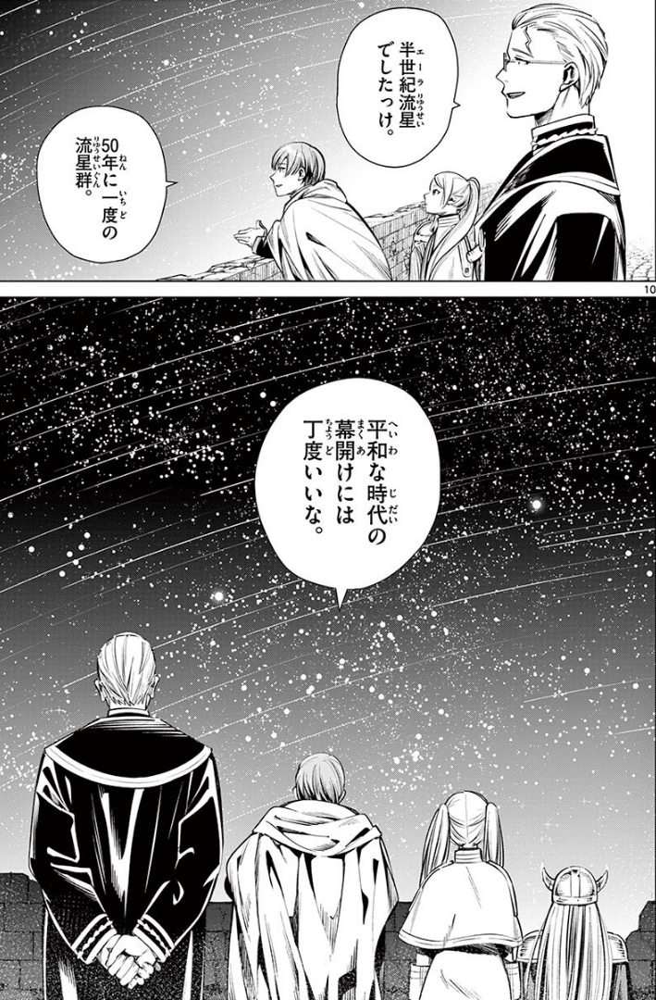

# Translate manga into English

- Simplied version of [comic-translate](https://github.com/ogkalu2/comic-translate)

### Configuration

- Update Azure OpenAI values in `translate_manga_into_english.py` to run the script.

```cmd
poetry install --no-root
```

```
AZURE_OPENAI_API_KEY = "<your-api-key>"  # Replace with your OpenAI API key
AZURE_OPENAI_MODEL_NAME = "<your-value>"  # Vision model for image analysis
AZURE_OPENAI_API_VERSION = "<your-value>"  # API version for OpenAI
AZURE_OPENAI_ENDPOINT = "https://<your-value>.openai.azure.com"
```

### Input & Output



```cmd
Translation Results:
Original: ５０年に一度の流星群。
Translation: "Once-in-50-years Meteor Shower."
----------------------------------------
Original: 平和な時代の幕開けには丁度いいな。
Translation: "A perfect time for the dawn of an era of peace."
----------------------------------------
Original: 半世紀流星でしたっけ。
Translation: "Was it called 'Half Century Meteor'?"
----------------------------------------
```

### Log output during processing

```cmd
Manga text detection and translation
Verifying and downloading models...
File pytorch_model.bin already exists with correct checksum
File config.json already exists with correct checksum
File preprocessor_config.json already exists with correct checksum
File README.md already exists with correct checksum
File special_tokens_map.json already exists with correct checksum
File tokenizer_config.json already exists with correct checksum
File vocab.txt already exists with correct checksum
File comic-text-segmenter.pt already exists with correct checksum
File comic-speech-bubble-detector.pt already exists with correct checksum
Loading models...
Config of the encoder: <class 'transformers.models.vit.modeling_vit.ViTModel'> is overwritten by shared encoder config: ViTConfig {
"_name_or_path": "facebook/deit-base-patch16-224",
"architectures": [
    "ViTForImageClassification"
],
"attention_probs_dropout_prob": 0.0,
"encoder_stride": 16,
"hidden_act": "gelu",
"hidden_dropout_prob": 0.0,
"hidden_size": 768,
"id2label": {
    "0": "tench, Tinca tinca",
    "1": "goldfish, Carassius auratus",
    "2": ...
    ...
    "291": "lion, king of beasts, PConfig of the decoder: <class 'transformers.models.bert.modeling_bert.BertLMHeadModel'> is overwritten by shared decoder config: BertConfig {
"_name_or_path": "cl-tohoku/bert-base-japanese-char-v2",
"add_cross_attention": true,
"architectures": [
    "BertForMaskedLM"
],
"attention_probs_dropout_prob": 0.1,
"classifier_dropout": null,
"hidden_act": "gelu",
"hidden_dropout_prob": 0.1,
"hidden_size": 768,
"initializer_range": 0.02,
"intermediate_size": 3072,
"is_decoder": true,
"layer_norm_eps": 1e-12,
"max_length": 300,
"max_position_embeddings": 512,
"model_type": "bert",
"num_attention_heads": 12,
"num_hidden_layers": 2,
"pad_token_id": 0,
"position_embedding_type": "absolute",
"tokenizer_class": "BertJapaneseTokenizer",
"torch_dtype": "float32",
"transformers_version": "4.49.0",
"type_vocab_size": 2,
"use_cache": true,
"vocab_size": 6144
}

Detecting text and bubbles...

0: 1024x672 3 text_comics, 1222.8ms
Speed: 11.4ms preprocess, 1222.8ms inference, 13.3ms postprocess per image at shape (1, 3, 1024, 672)

0: 1024x672 3 text_bubbles, 973.0ms
Speed: 9.7ms preprocess, 973.0ms inference, 1.3ms postprocess per image at shape (1, 3, 1024, 672)
Detected 3 text regions and 3 speech bubbles
Performing OCR...
OCR succeeded on 3 text regions
Translating text...
...
```